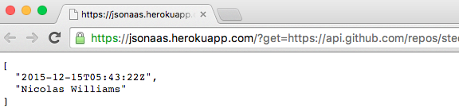

README
======

This Node.js web app wraps [jq](https://github.com/stedolan/jq) as a `child_process` and returns the reponse as a service (HTTP).

Whenever I have the time or knowledge I will work this out using `libjq` but since there is no binding for any "easy" language probably that's not going to happen soon.

This is clearly not the most efficient way to invoke `jq` capabilities I'm just trying to solve a problem, integrating disparate API's on Rundeck where only HTTP GET requests can be made on some cases to integrate different resources.

Example use case: combine the feature of Rundeck where allowed values can come from a "Remote URL" with output from PuppetDB using `jqaas` to transform the PuppetDB output into the format that Rundeck "wants".

* Rundeck [option model provider documentation](http://rundeck.org/docs/manual/jobs.html?#option-model-provider)
* [PuppetDB documentation](http://docs.puppetlabs.com/puppetdb/latest/api/index.html)

Security warning: This service can expose the environment where the application is running. `jq` program can access the environment through the `env` object. Don't save sensitive information in environment variables.

API
---

### /

#### GET

`curl` example:

Get the name and date of the last commiter to the `jq` project.

    $ curl -gs 'localhost:3000/?get=https://api.github.com/repos/stedolan/jq/commits%3Fper_page=1&filter=.|.[]|("\(.commit.author.date)%20\(.commit.author.name)")'
    2015-12-15T05:43:22Z Nicolas Williams

Browser example:

* Most recent `jq` commit date and author &#9755; https://jsonaas.herokuapp.com/?get=https://api.github.com/repos/stedolan/jq/commits%3Fper_page=1&filter=[.[].commit.author.date,%20.[].commit.author.name]
   
  

**Note 1**: The `curl` `-g` parameter was passed because curl interprets square brackets as special sequences, see `curl(1)` for more information about this feature.

**Note 2**: The GitHub API `?per_page` parameter have to be URL encoded, `curl` URL encodes automatically the rest of the special characters, other clients may have trouble with `:, /, |, [, /` characters. URL encode them before setting the `get' parameter to avoid trouble.

#### POST

`curl` example:

Get the version of Express that the project is using.

    $ curl -d@- -gs 'localhost:3000/?filter=.dependencies.express' < package.json 
    ~4.13.1

**Note 1**: The `Content-Type` of the request is always understood as `application/json` any other content will render a `400 Bad Request` directly from Express.

**Note 2**: With this technique JSON filtering can also be used in pipelines, example: `some-program | curl -d@- -s jqaas-location/?filter=some-filter`

General notes
-------------

* `jq` exit code is returned in the `X-Return-Code` especial header, any non `0` exit code will render a `400 Bad Request` response and the body of the response will contain the standard error of `jq` execution.

* The flag `-r` is passed to `jq`.

* The domain used in the examples (https://jsonaas.herokuapp.com/) is Heroku free dyno, do not rely on it. I have compiled `jq` 1.5 without `env` support, do not try to exploit it.

Similar projects
----------------

* David Dollar [jqaas](https://github.com/ddollar/jqaas)

Thanks
------

* Stephen Dolan **amazing** [jq](https://stedolan.github.io/jq/)
